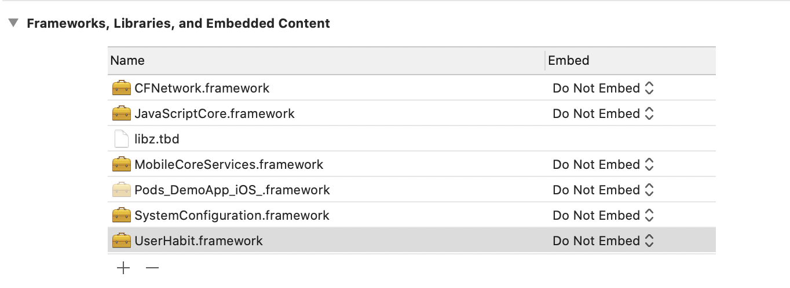
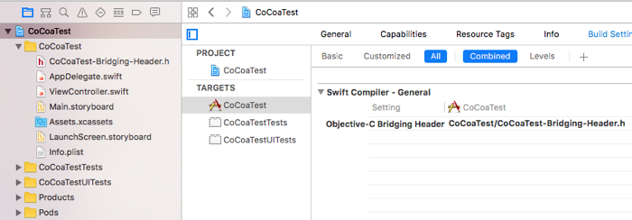
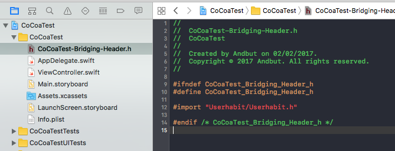

# SDK 적용하기

## 1. **라이브러리 추가하기**

아래 방식 중 개발환경에 맞는 메뉴를 선택해서 적용해주세요.*(메뉴 왼쪽의 ▶︎버튼을 누르면 메뉴가 펼쳐집니다.)*

- **Download 방식**
    1. [링크](https://s3-ap-northeast-1.amazonaws.com/userhabit-production/sdks/UserHabit.framework_1.1.15.zip)를 클릭해 iOS용 유저해빗 SDK를 다운로드 하세요.
    2. 아래의 예시와 같이 관련 Frameworks(UserHabit, CFNetwork, MobileCoreService, WebKit, libz)들을 iOS 프로젝트 Linked Frameworks and Libraries에 추가합니다.

        

    3. 해당 파일의 local 경로를 Project/Build Setting/Framework Search Paths에 추가합니다.
- **CocoaPods 방식**

    Podfile에 `pod 'UserHabitSDK'`을 추가하고 pod install을 실행해주세요.

    해당 파일의 local 경로를 Project/Build Setting/Framework Search Paths 에 추가합니다.

## 2. 브리지 헤더 추가하기

 Swift의 경우, Objective-C의 코드를 읽기 위한 브리지 헤더(Bridging Header)의 추가 작업이 필요합니다. 이미 사용중이시면 프레임워크를 import하는 코드만 추가하시면 됩니다. 추후 업데이트를 통해 브리지 헤더를 사용하지 않아도 빌드되도록 개선할 예정입니다. 아래의 순서로 브리지 헤더를 추가하고 프로젝트에 설정합니다.

1. 프로젝트에 `$(PROJECT_NAME)-Bridging-Header.h`파일을 추가합니다.
2. Xcode의 Navigator >> TARGETS >> Build Settings >> "Objective-C Bridging Header" 에 위에서 생성한 파일 이름으로 브리지 헤더 설정 `$(PROJECT_NAME)/$(PROJECT_NAME)-Bridging-Header.h`을 추가합니다.

    

3. 1에서 만든 `$(Project Name)-Bridging-Header.h`파일에 `#import "Userhabit/Userhabit.h"`을 추가해 UserHabit framework를 import 합니다.

    

4. 문제없이 빌드되는지 확인합니다.

Xcode의 Navigator >> TARGETS >> Build Settings >> "Objective-C Bridging Header" 에 위에서 생성한 파일명으로 브리지 헤더 설정 `$(PROJECT_NAME)/$(PROJECT_NAME)-Bridging-Header.h`을 추가합니다.

## 3. **소스 코드 추가하기**

1. 로그인 후 UserHabit 콘솔에서 앱을 등록하고 Test API 키와 Production API 키를 발급 받습니다.
2. AppDelegate 파일에서 아래의 부분에 알맞은 API 키를 입력하여 코드를 삽입합니다. Window가 생성된 이후에 코드가 삽입되어야 액션 수집이 가능합니다.

```swift
@UIApplicationMain
class AppDelegate: UIResponder, UIApplicationDelegate {

    var window: UIWindow?

    func application(application: UIApplication, didFinishLaunchingWithOptions launchOptions: [NSObject: AnyObject]?) -> Bool {

        UserHabit.sessionStart("YOUR-API-KEY", withAutoTracking:true)

        return true
    }
}
```